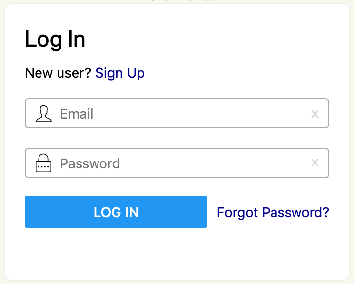

# AuthUI

Login Components

- Cross-platform: react-native, react-native-web, styled-components, tailwind-rn.
- Connect to [AuthUI APIs](https://github.com/authui/authui-server) using graphql-request.



- Live Example: [Codesandbox](https://codesandbox.io/s/authui-example-8jswg?module=/src/LoginBox/LoginBox.tsx)

## Development

Storybook:
```
npm install
npm run storybook
```

Open http://localhost:9009

### Commands

```
npm start
npm test
npm run build
```

### Storybook


### Contributions

Please open a pull request. Any contribution is welcome!